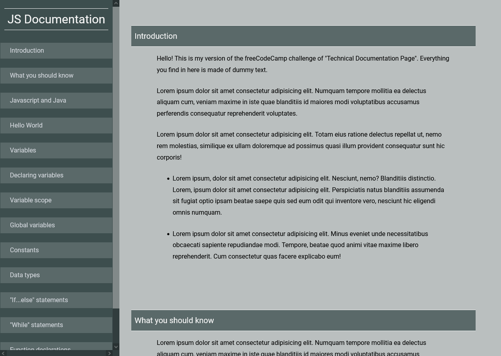

_This README.md file is in English and Portuguese. // Esse arquivo README.md está em Inglês e Português._

# EN: Freecodecamp #04 Responsive Web Design: A technical documentation page

This repository contains my solution to the freecodecamp #04 challenge on "Responsive Web Design Project". This is part of a series of incremental HTML and CSS Projects in order to obtain the "Responsive Web Design" certificate from [freeCodeCamp.](freecodecamp.org/)

This first challenge was supposed to create a very simple Tribute Page with HTML and CSS. The second challenge was meant to create a simple survey form with HTML and CSS. The third challenge was meant to create a simple landing-page of a product of your choice. In this fourth challenge, the aim was to create a technical documentation page. 

I used lorem ipsum to achieve this. The content is entirely made-up, except the headers... which I took from the course example.

## Responsive Web Design Projects:

1. Simple Ada Lovelace Tribute Page
2. A freeCodeCamp Survey Form
3. A Product Landing-Page
4. **A technical documentation page**

The main goal is to practice the content seen in the course in order to achieve the necessary solution required to go to the next step.

### MY SOLUTION

# EN: Freecodecamp #04 Responsive Web Design: página técnica de documentação

Esse repositório contém a minha solução para o desafio número 04 do freecodecamp do curso "Responsive Web Design". Isso é parte de uma série de projetos incrementais em HTML e CSS requisitados para obtenção do certificado em "Responsive Web Design" do [freeCodeCamp.](freecodecamp.org/)

O primeiro desafio era para criar um versão muito simples de uma página tributo ("homenagem") feita apenas em HTML e CSS. O segundo desafio era criar um formulário de perguntas também feito em HTML e CSS. O terceiro desafio foi a criação de uma landing-page de um produto. O quarto desafio é esta criação de uma página de documentação técnica. 

Eu usei lorem ipsum para alcançar os resultados. O conteúdo é todo falso, com exceção dos headers... que eu retirei do exemplo do curso. 

## Projetos do Responsive Web Design:

1. Simple Ada Lovelace Tribute Page
2. A freeCodeCamp Survey Form
3. A Product Landing-Page
4. **A technical documentation page**

O principal objetivo é praticar o conteúdo visto no curso e alcançar a solução necessária para ir para a próxima etapa.

### MINHA SOLUÇÃO

